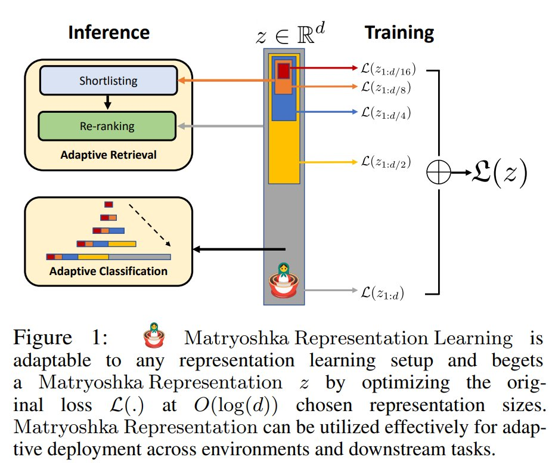
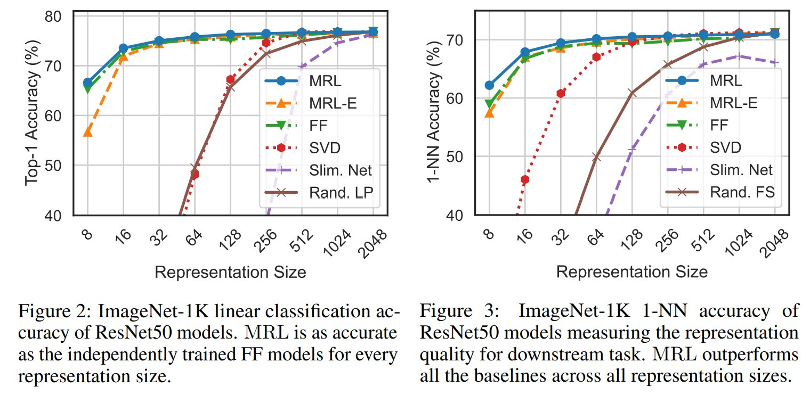

# [Matryoshka Representation Learning](https://arxiv.org/abs/2205.13147)
_Aditya Kusupati*, Gantavya Bhatt*, Aniket Rege*, Matthew Wallingford, Aditya Sinha, Vivek Ramanujan, William Howard-Snyder, Kaifeng Chen, Sham Kakade, Prateek Jain, Ali Farhadi_

Learned representations are used in multiple downstream tasks like web-scale search & classification. However, they are flat & rigid -- Information is diffused across dimensions and cannot be adaptively deployed without large post-hoc overhead. We fix both of these issues with **Matryoshka Representation Learning** (MRL)🪆. 

<p align="center">

</p>

This repository contains code to train, evaluate, and analyze Matryoshka Representations with a ResNet50 backbone. The training pipeline uses standard PyTorch and TorchVision dataloaders while keeping the MRL method in `MRL.py` unchanged. The repository is organized as follows:

1. Set up
2. Matryoshka Linear Layer
3. Training ResNet50 Models
4. Inference
5. Model Analysis
5. Retrieval


## Set Up
Pip install the requirements file in this directory. Note that a python3 distribution is required:
```
pip3 install -r requirements.txt
```

### Preparing the Dataset
ImageNet training expects the standard TorchVision `ImageFolder` layout:

```text
imagenet/
  train/
    class_1/
    class_2/
    ...
  val/
    class_1/
    class_2/
    ...
```

CIFAR-100 uses `torchvision.datasets.CIFAR100` and downloads automatically when needed. Pass the dataset root with `--data.root=/path/to/data/root`.

## Matryoshka Linear Layer
We make only a minor modification to the ResNet50 architecture via the MRL linear layer, defined in `MRL.py`, which can be instantiated as:
```
nesting_list = [8, 16, 32, 64, 128, 256, 512, 1024, 2048]
fc_layer = MRL_Linear_Layer(nesting_list, num_classes=1000, efficient=efficient)
```
Where `nesting_list` is the list of representation sizes we wish to train on, `num_classes` is the number of output features, and the `efficient` flag is to train MRL-E.

## T-Orthogonal MRL

T-Orthogonal MRL implements the transition sketch where the CE losses stay nested at `[8d, 16d, 32d, 64d, ...]`, and each transition `T_i` is its own orthogonal layer. For a nesting list `[8, 16, 32, 64]`, the head creates `T16: 16 -> 16`, `T32: 32 -> 32`, and `T64: 64 -> 64`. The smallest classifier sees the raw 8-dimensional prefix directly. Each larger classifier sees `T_d(h[:d])`, so `T` is always applied to the raw backbone prefix `h` at that scale rather than to an earlier transformed prefix.

This keeps the Matryoshka CE objective at every prefix while making the transition operator explicit and orthogonally constrained. T layers are initialized to identity and can use either `matrix_exp` or `householder` orthogonal parametrization.

Example CIFAR-100 run:

```bash
cd train
python train_imagenet.py \
  --config-file rn50_configs/rn50_cifar100.yaml \
  --data.root="$HOME/.cache/torchvision" \
  --model.t_orthogonal_mrl=1 \
  --model.t_orthogonal_map=matrix_exp \
  --logging.folder=./tmp \
  --logging.run_name=t_orthogonal_mrl_cifar100
```

## Block-Orthogonal Residual MRL / BOR-MRL

BOR-MRL is a prefix-preserving variant of Matryoshka training. Standard MRL applies classifiers to coordinate prefixes of one feature vector. The main BOR-MRL method keeps the smallest prefix unchanged, then builds each larger representation by passing the previously built prefix through an orthogonal layer and concatenating the next raw residual block. For example, with `[8, 16, 32]`, the 8-dimensional classifier sees raw `h[:8]`; the 16-dimensional classifier sees `[Q_8 h[:8], h[8:16]]`; the 32-dimensional classifier sees `[Q_16 z_16, h[16:32]]`.

A single full-feature orthogonal layer would be mathematically wrong for Matryoshka prefixes because it could mix later coordinates into earlier prefixes. BOR-MRL only transforms already-available lower-dimensional prefixes before adding new coordinates. After that transform, it uses the same style of independent linear prefix classifiers and softmax cross-entropy training as standard MRL. The default implementation uses PyTorch orthogonal parametrization with the `matrix_exp` map; `cayley` and `householder` are available for ablations. `frozen` mode initializes orthogonal transforms and keeps them fixed during training.

The repository also includes the earlier independent-block variant behind `--model.bor_block_mrl=1`. That method transforms every residual coordinate block separately, then applies the MRL classifiers to prefixes of the transformed vector. With `[8, 16, 32]`, it builds `[Q_8 h[:8], Q_8' h[8:16], Q_16 h[16:32]]` and classifies the 8, 16, and 32 dimensional prefixes of that transformed vector.

Stop-gradient before BOR orthogonal maps is controlled by `--model.bor_stop_gradient`. The default is `0`, meaning off for every BOR method. Use `1` to turn it on; `-1` is accepted as "use the class default", which is also off.

For the no-rotation stop-gradient ablation, use `--model.cascade_stop_gradient_mrl=1`. This builds prefixes as `[sg(z_old), h_new]` with raw residual blocks and independent MRL classifiers. The cascade stop-gradient default is on; use `--model.cascade_stop_gradient=0` to disable it for a control run.

Example CIFAR-100 run:

```bash
cd train
python train_imagenet.py \
  --config-file rn50_configs/rn50_cifar100.yaml \
  --data.root="$HOME/.cache/torchvision" \
  --model.bor_mrl=1 \
  --model.bor_mode=orthogonal \
  --model.bor_orthogonal_map=matrix_exp \
  --model.bor_use_trivialization=1 \
  --model.bor_stop_gradient=0 \
  --logging.folder=./tmp \
  --logging.run_name=bor_mrl_cifar100
```

For the independent residual-block variant, replace `--model.bor_mrl=1` with:

```bash
--model.bor_block_mrl=1
```

For the cascade stop-gradient ablation, replace `--model.bor_mrl=1` with:

```bash
--model.cascade_stop_gradient_mrl=1
```

## [Training ResNet50 models](train/)
<p align="center">

</p>

Training runs in a single Python process with TorchVision dataloaders. If multiple CUDA devices are visible, the trainer uses `torch.nn.DataParallel`; limit or choose GPUs with `CUDA_VISIBLE_DEVICES`. The `rn50_40_epochs.yaml` configuration trains ImageNet ResNet50 models for 40 epochs. While training, we dump model checkpoints and training logs by default.

### Training Fixed Feature Baseline

```bash 
export CUDA_VISIBLE_DEVICES=0,1
export IMAGENET_DIR=/path/to/imagenet

python train_imagenet.py --config-file rn50_configs/rn50_40_epochs.yaml --model.fixed_feature=2048 \
--data.root=$IMAGENET_DIR --data.num_workers=12 --logging.folder=trainlogs --logging.log_level=1 \
--lr.lr=0.425
```

### Training MRL model

```bash 
export CUDA_VISIBLE_DEVICES=0,1
export IMAGENET_DIR=/path/to/imagenet

python train_imagenet.py --config-file rn50_configs/rn50_40_epochs.yaml --model.mrl=1 \
--data.root=$IMAGENET_DIR --data.num_workers=12 --logging.folder=trainlogs --logging.log_level=1 \
--lr.lr=0.425
```

### Block-wise cascade conflict-gated MRL

Conflict gating is disabled by default, so the standard MRL command above keeps the original weighted-sum loss and backward pass. To smoke-test the block-cascade mode on CIFAR-100, run a short normal MRL job and then the gated variant:

```bash
cd train

python train_imagenet.py --config-file rn50_configs/rn50_cifar100.yaml --model.mrl=1 \
--data.root=$HOME/.cache/torchvision --logging.folder=../tmp/smoke_normal \
--logging.run_name=mrl_normal --training.epochs=2 --training.batch_size=32 \
--validation.batch_size=32 --data.num_workers=0 --logging.log_level=1

python train_imagenet.py --config-file rn50_configs/rn50_cifar100.yaml --model.mrl=1 \
--data.root=$HOME/.cache/torchvision --logging.folder=../tmp/smoke_gated \
--logging.run_name=mrl_block_cascade --training.epochs=2 --training.batch_size=32 \
--validation.batch_size=32 --data.num_workers=0 --logging.log_level=1 \
--mrl-conflict-gating --mrl-conflict-mode=block_cascade \
--mrl-conflict-alpha=0.5 --mrl-conflict-eps=1e-8

python -m pytest ../tests/test_MRL.py -k "block_cascade"
```

The gated run logs adjacent cosine alignment, conflict fraction, projection magnitude, and per-adjacent-pair diagnostics. Check the `train_loss` entries in each run's `log` file for the two-epoch loss trend. The focused unit tests include a tiny encoder/head smoke step that checks encoder gradients and classifier-head gradients are both populated.

### Training MRL-E model

```bash 
export CUDA_VISIBLE_DEVICES=0,1
export IMAGENET_DIR=/path/to/imagenet

python train_imagenet.py --config-file rn50_configs/rn50_40_epochs.yaml --model.efficient=1 \
--data.root=$IMAGENET_DIR --data.num_workers=12 --logging.folder=trainlogs --logging.log_level=1 \
--lr.lr=0.425
```

By default, we start nesting from rep. size = 8 (i.e. $2^3$). We provide flexibility in starting nesting, for example from rep. size = 16, with the `nesting_start` flag as: 
```
# to start nesting from d=16
--model.nesting_start=4
```

## [Inference on Trained Models](inference/)

### Classification performance
To evaluate our models, we utilize the `pytorch_inference.py` script; arguments in brackets are optional. This script is also able to evaluate the standard Imagenet-1K validation set (V1). To evaluate the Fixed Feature (FF) Baseline, pass `--rep_size <dim>` flag to evaluate a particular representation size. For example, to evaluate an FF model with rep. size = 512:

```python
cd inference

python pytorch_inference.py --path <final_weight.pt> --dataset <V2/A/Sketch/R/V1> --rep_size 512
```

Similarly, to evaluate MRL models, pass the `--mrl` flag (add `--efficient` for MRL-E). Note that for MRL models, the `rep_size` flag is not required. The general form of the command to evaluate trained models is:

```python
cd inference

python pytorch_inference.py --path <final_weight.pt> --dataset <V2/A/Sketch/R/V1> \
[--tta] [--mrl] [--efficient] [--rep_size <dim>] [--old_ckpt] [--save_logits] \
[--save_softmax] [--save_gt] [--save_predictions]
```

The `save_*` flags are useful for downstream [model analysis](model_analysis). Our script is able to perform "test time augmentation (tta)" during evaluation with the `--tta` flag. Note that the classification results reported in the paper are without tta, and tta is only used for adaptive classification using model cascades. Please refer to [model analysis](model_analysis) for further details.


Lastly, to evaluate our uploaded checkpoints (ResNet50), please additionally use the `--old_ckpt` flag. Our model checkpoints can be found [here](https://drive.google.com/drive/folders/1IEfJk4xp-sPEKvKn6eKAUzvoRV8ho2vq?usp=sharing), and are arranged according to the training routine. The model naming convention is such that `r50_mrl1_e0_ff2048.pt` corresponds to the model trained with MRL (here "e" refers to efficient) and `r50_mrl0_e0_ff256.pt` corresponds to the model with rep. size = 256 and trained without MRL. In the paper we only consider $rep. size \in  [8, 16, 32, 64, 128, 256, 512, 1024, 2048]$. To evaluate on other rep. sizes, change the variable `NESTING_LIST` in `pytorch_eval.py`. For a detailed description, please run `python pytorch_inference.py --help`.

#### Robustness Datasets

We also evaluate our trained models on four robustness datasets: ImageNetV2/A/R/Sketch. Note that for evaluation, we utilized PyTorch dataloaders. Please refer to their respective repositories for additional documentation and download the datasets in the root directory. 

1. [ImageNetV2_pytorch](https://github.com/modestyachts/ImageNetV2_pytorch)
2. [ImageNetA](https://github.com/hendrycks/natural-adv-examples)
3. [ImageNetR](https://github.com/hendrycks/imagenet-r)
4. [ImageNet-Sketch](https://github.com/HaohanWang/ImageNet-Sketch)


## [Model Analysis](model_analysis/)
`cd model_analysis` 

We provide four Jupyter notebooks which contain performance visualization via GradCAM images (for checkpoint models), superclass performance, model cascades and oracle upper bound. Please refer to detailed documentation [here](model_analysis/).  

## [Retrieval](retrieval/)
We carry out image retrieval on ImageNet-1K with two query sets, ImageNet-1K validation set and ImageNetV2. We also created [ImageNet-4K](imagenet-4k) to evaluate MRL image retrieval in an out-of-distribution setting, with its validation set used as query set. CIFAR-100 retrieval is also supported with the train split as the database and the test split as the query set. A detailed description of the retrieval pipeline is provided [here](retrieval/). 

In an attempt to achieve optimal compute-accuracy tradeoff, we carry out **Adaptive Retrieval** by retrieving a $k=$ 200 length neighbors shortlist with lower dimension $D_s$ and reranking with higher dimension $D_r$. We also provide a simple cascading policy to automate the choice of appropriate $D_s$ and $D_r$, which we call **Funnel Retrieval**. We retrieve a shortlist at $D_s$ and then re-rank the shortlist five times while simultaneously increasing $D_r$ (rerank cascade) and decreasing the shortlist length $k$ (shortlist cascade), which resembles a funnel structure. With both of these techniques, we are able to match the Top-1 accuracy (%) of retrieval with $D_s=$ 2048 with 128$\times$ less MFLOPs/Query on ImageNet-1K.

## Citation
If you find this project useful in your research, please consider citing:
```
@inproceedings{kusupati2022matryoshka,
  title     = {Matryoshka Representation Learning},
  author    = {Kusupati, Aditya and Bhatt, Gantavya and Rege, Aniket and Wallingford, Matthew and Sinha, Aditya and Ramanujan, Vivek and Howard-Snyder, William and Chen, Kaifeng and Kakade, Sham and Jain, Prateek and others},
  title     = {Matryoshka Representation Learning.},
  booktitle = {Advances in Neural Information Processing Systems},
  month     = {December},
  year      = {2022},
}
```
